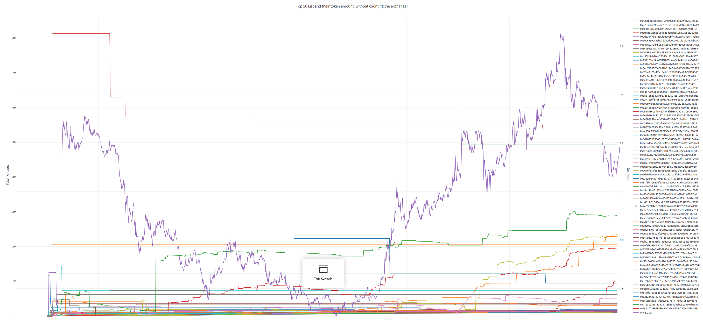
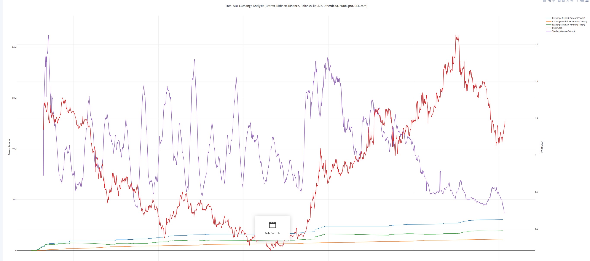

# ICO Top holder analysis
> *"Human tuned heuristic Python Library for ICO company analysis."*


### Table of Contents
* [Installation](#installation)
* [Usage](#usage)
* [Customization](#customization)
* [License](#license)

### Installation
Clone the git repository:
```console
$ git clone https://github.com/DeuroIO/erc20-ico-onchain-technical-analysis.git && cd erc20-ico-onchain-technical-analysis
```

Install necessary dependencies
```console
$ pip install -r requirements.txt
```


### Usage
Create a share object.
```python
python main.py
```
#### 1.total-abt-exchange-analysis
https://plot.ly/~gelei/586/total-abt-exchange-analysis-bittrex-bitfinex-binance-poloniexliquiio-etherdelta-/#/


#### 2.top-50-list-and-their-token-amount-without-counting-the-exchange
https://plot.ly/~gelei/588/top-50-list-and-their-token-amount-without-counting-the-exchange/#/


#### 3.top-50-token-amount-moving-average-without-counting-the-exchange
https://plot.ly/~gelei/590/top-50-token-amount-moving-average-without-counting-the-exchange/#/


#### 4.exchange-token-amount
https://plot.ly/~gelei/592/exchange-token-amount/#/


#### 5.hourly-{token}-exchange-analysis
https://plot.ly/~gelei/594/hourly-abt-exchange-analysis-bittrex-bitfinex-binance-poloniexliquiio-etherdelta/#/


### Customization
If you want to customize for a different token, you can change the address in the code for now. In the near future, we will support cli integration.


### License
This code has been released under the [MIT License](LICENSE).
